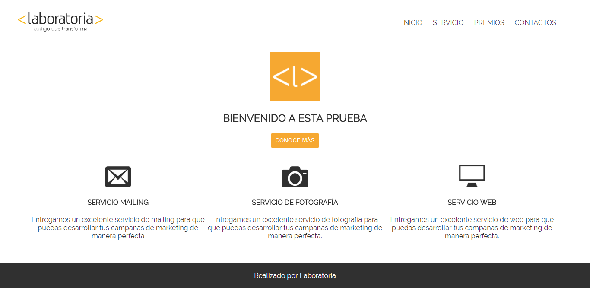

### SEMINARIO CSS 

## Objetivo funcional

Creación de una página como la siguiente imagen:

## Objetivo Técnico

Poner en práctica nuestros conocimientos en css.

## Herramientas

    + Editor Visual Studio Code
        + HTML5
        + CSS3